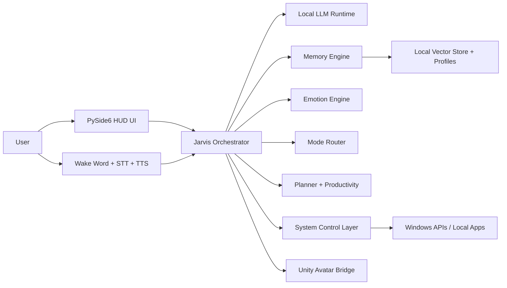

# Architecture

## Product Objective

AntiGravity Jarvis should feel like an intelligent desktop entity with four strong pillars:

1. A capable offline reasoning core
2. Natural voice interaction
3. A visually alive avatar presence
4. Useful real-world control over the computer

## High-Level System



## Core Design Principles

- Offline-first: after model installation, the system does not require internet access
- Modular: each subsystem can be upgraded independently
- Low-latency: voice and UI feel responsive even on mid-range systems
- Safe: system actions require intent classification and permission policies
- Cinematic: avatar motion, speech, and HUD should feel premium

## Recommended Runtime Split

### 1. Python Control Core

The Python app owns:

- conversation orchestration
- memory reads and writes
- local LLM requests
- mode switching
- productivity features
- system automation
- emotion tagging
- UI state publishing
- avatar command streaming

### 2. Desktop UI Layer

Use PySide6 for:

- main dashboard
- floating assistant panel
- glassmorphism HUD
- waveform and status indicators
- settings and memory management screens

### 3. Avatar Engine

Use Unity as a dedicated local runtime because it is best suited for:

- high-quality humanoid rendering
- lip sync
- blend shapes
- gaze tracking
- idle loops
- animation graphs
- hologram materials

The Python core should talk to Unity through local WebSocket or named pipes. This keeps the avatar independent from the control brain and makes iteration much easier.

## Module Responsibilities

### `core.orchestrator`

Central brain that coordinates:

- input parsing
- tool selection
- memory recall
- response generation
- emotion state updates
- avatar cues

### `services.llm.runtime`

Abstraction over a local model backend such as:

- Ollama
- llama.cpp HTTP server
- LocalAI

The runtime should support role prompts, streamed responses, and model routing by task type.

### `brain.memory`

Split memory into:

- short-term conversation memory
- long-term profile memory
- episodic memories
- preference memory
- task memory

Use a local vector store for semantic recall plus a structured user profile file for stable facts.

### `emotion.engine`

This layer estimates:

- user emotion
- response empathy level
- avatar facial state
- TTS tone recommendation
- glow and color cues

### `voice.*`

Pipeline:

1. Wake word detection
2. Streaming STT
3. Turn endpoint detection
4. LLM processing
5. TTS output
6. Barge-in interruption support

### `control.system_actions`

This should expose safe wrappers for:

- launching apps
- closing apps
- file search
- file creation
- volume and brightness control
- IDE launch
- local script execution

Keep a permissions registry so risky actions are explicit.

### `avatar.avatar_bridge`

Sends:

- speech start and stop
- viseme timing
- expression tags
- posture state
- gesture cues
- glow color
- idle state changes

## Data Model

Suggested local storage:

```text
data/
├─ memory/
│  ├─ chroma/
│  ├─ profile.json
│  ├─ preferences.json
│  └─ episodic_log.jsonl
├─ tasks/
│  ├─ reminders.json
│  └─ agenda.json
├─ voice/
│  └─ custom_profiles/
└─ telemetry/
   └─ offline_metrics.jsonl
```

## Recommended Request Flow

1. Capture user input from text or voice.
2. Detect language, intent, and emotional tone.
3. Retrieve relevant long-term memories and active tasks.
4. Route to the right assistant mode.
5. Query the correct local model.
6. Post-process response for Jarvis persona and safety.
7. Trigger TTS and avatar animation cues.
8. Save useful memory updates and task changes.

## Safety Model

Use a three-tier action policy:

- `safe`: allowed immediately, such as opening calculator
- `confirm`: requires confirmation, such as closing multiple apps
- `blocked`: never allowed automatically, such as destructive shell commands without explicit consent

## Performance Strategy

- Use a 7B or 8B instruct model as the everyday assistant
- Use a small fallback model for low-RAM mode
- Keep STT and TTS in separate worker threads
- Use streamed generation to reduce perceived latency
- Run the avatar renderer as a sidecar process
- Preload common animations and voice assets

## Why This Architecture Works

This split gives us a practical route to a premium product:

- Python makes local tooling, automation, and AI orchestration fast to build
- PySide6 gives us a polished desktop shell
- Unity gives us believable real-time character rendering
- All communication stays local, which preserves the offline promise
